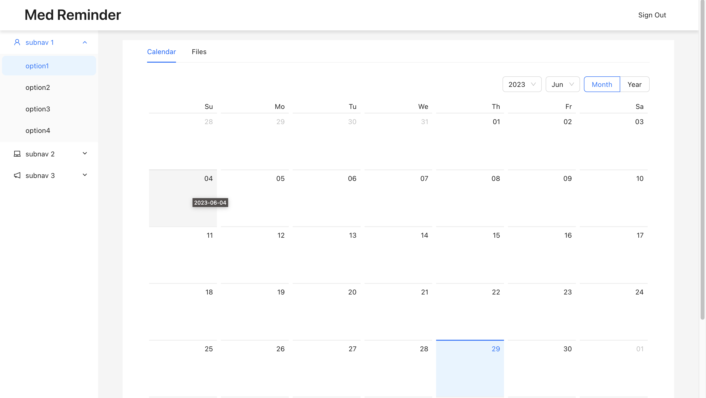

# Med assistant 

A project for managing personal medical exams and maintaining a medical calendar.

## Project technology stack
### Backend:

**python 3.9**

- Web server:
    - aiohttp # https://docs.aiohttp.org/en/stable/
- ORM:
    - sqlalchemy # https://docs.sqlalchemy.org/en/20/
    - aiohttp-sqlalchemy # https://aiohttp-sqlalchemy.readthedocs.io/en/latest/
    - aiosqlite # https://pypi.org/project/aiosqlite/

- Storage:
    - boto3 # https://boto3.amazonaws.com/v1/documentation/api/latest/index.html

- DB migrations:
    - alembic # https://alembic.sqlalchemy.org/en/latest/

### Frontend:

**node 19**

- Main framework:
    - react v18
- UI framework:
    - antd # https://ant.design/components/upload
- Fetch lib:
    - axios # https://axios-http.com/docs/intro

## Current status of the project
pages:
- login page 
- plain calendar 
- list of downloaded files 
- upload form

## TODO

1. [Back] Refactor User backend logic
2. [Front] Clean menu on main pages 
2. [Front] Create design plan
2. [Front] Modify Files list
3. [Back] Add calendar events
4. [Back][Front] Create files classification.
5. [Back] Integrate with telegram bot (for notifications)

# Setup dev environment

1. `docker-compose build`

2. `docker-compose up`
